# Trek With Me
It's android app which acts as a comprehensive guide to the best hikes near by. With a thoroughness of a printed map, elevation profiles, photo and description, interactive features, rent gears and more.

# Introduction

Trekking is a form of walking, undertaken with the specific purpose of exploring and enjoying the scenery. It usually takes place on trails in areas of relatively unspoiled wilderness."

The great mountain ranges are some of the most beautiful and interesting areas of the world to visit. As they are often not served by roads, they can also be the most remote and difficult places to get to and the only real way to see them is on foot. For some people the trekking may be an end in itself, for others it is a means to enjoy the magnificent panoramas and often the peoples of the mountains with their culture, traditions and religions provide an equal interest to the scenery.

To create an android application which will give services to a tourist. A tourist needs modern technologies which can serves for them. So the android application should be easy to use and efficient to manage the trekking activities. The proper trekking guide is not available which could detect a current location, calculate distance and provide proper guidelines

# Objective

	To provide easy to use GUI and Navigation Controls

	 Simply Fast and easy to look for places.

	 Guides you for choosing trek nearby to you.

	To display GPS route info.

	To help rent gears for the adventurous trek.

	To include some of the packing tips.

# Software Specifications:-

	Android Studio

  o Android
  
  o	Linux Kernel
  
  o	Hardware Abstraction Layer (HAL)
  
  o	Android Runtime
  
  o	Native c/c++ libraries
  
  o	Java API framework
  
# Block Diagram

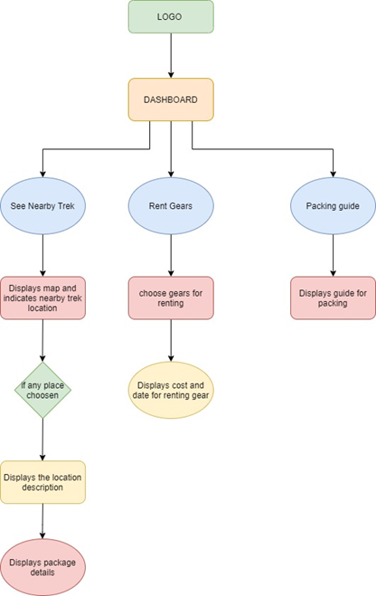

# Google API

   Google APIs is a set of application programming interfaces (APIs) developed by Google which allow communication with Google Services and their integration to other services. Examples of these include Search, Gmail, Translate or Google Maps. Third-party apps can use these APIs to take advantage of or extend the functionality of the existing services.

  	The APIs provide functionality like analytics, machine learning as a service (the Prediction API) or access to user data (when permission to read the data is given). Another important example is an embedded Google map on a website, which can be achieved using the Static maps API, Places API or Google Earth API.
  
# Foursquare API

  The Foursquare API allows application developers to interact with the Foursquare platform. The API itself is a RESTful set of addresses to which you can send requests, so there's really nothing to download onto your server. That being said, in this article, you use a set of PHP libraries to help simplify requests and responses, but this is an entirely optional step.
 
  You can currently request output in XML or JSON format, making requests to URLs that look like this: http://api.foursquare.com/v1/user.json. If you don't use an extension on your request, then XML is served back to you. A request to http://api.foursquare.com/v1/user results in an XML output.
 
 # Screenshots
    
     Logo Screen
 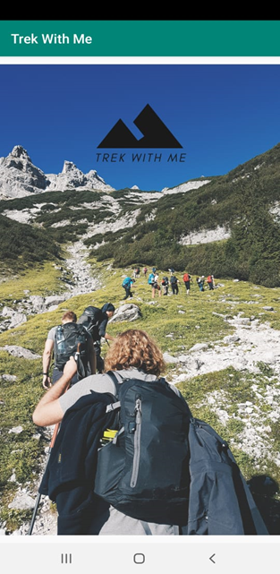
 
     Menu Screen
 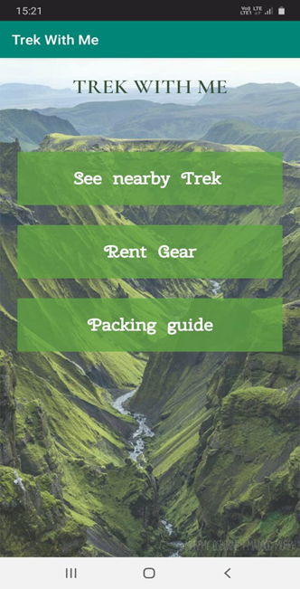
  
     Location Near Me Screen
  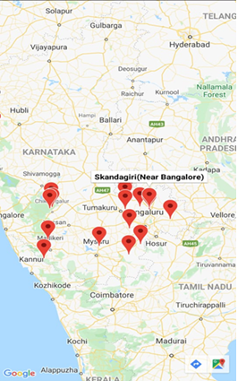 
  
     Navigation Screen
   
  
     Place Suggestion-1 Screen
  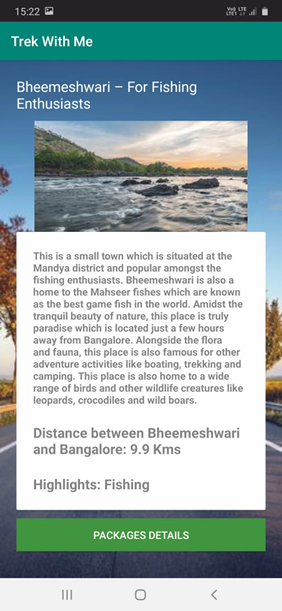
  
     Place Suggestion-2 Screen
  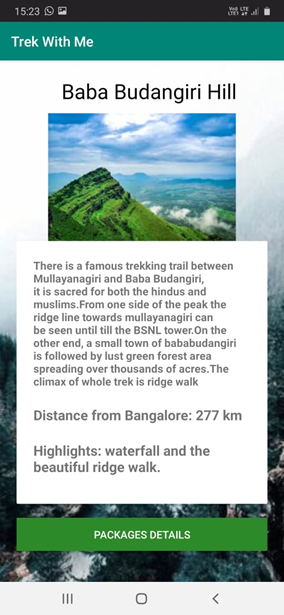
  
     Place Suggestion-3 Screen
  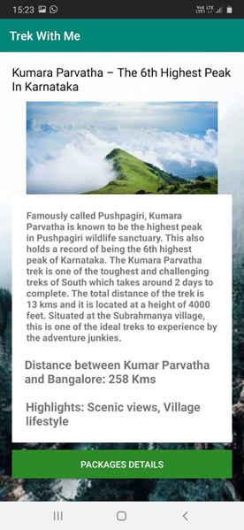
  
     Place Suggestion-4 Screen
  
  
     Package Details Screen
  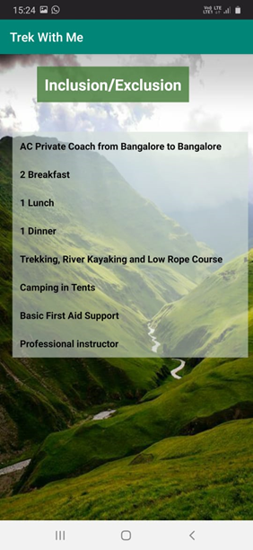
  
     Rent Gears-1 Screen
  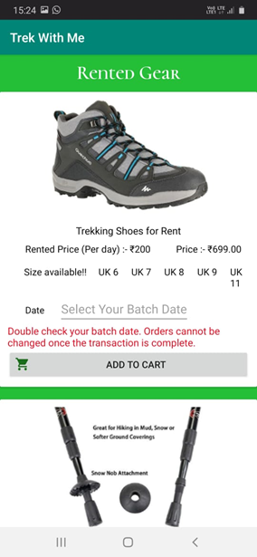
  
     Rent Gears-2 Screen
  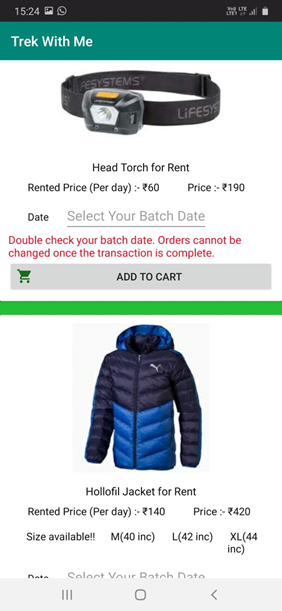
  
     Rent Gears-3 Screen
  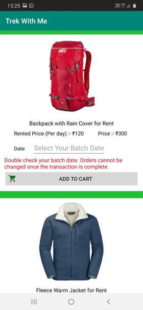
  
      Package Guide Screen
  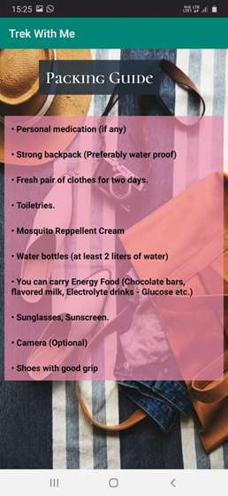
    
 # Conclusion
 
  To create an android application which will give services to a tourist .A tourist needs modern technologies which can serves for them. So the android application should be easy to use and efficient to manage the trekking activities. The proper trekking guide is not available which could detect a current location, calculate distance and provide proper guidelines. Different problems arise while a tourist travel to trekking spot which can address by development of the system which will provide accurate global positing system (GPS) coordinates ,provide real time direction, textual and pictorial information about the trekking locations. 
 
   In the above discussion, it is obvious that android platform has an efficient mobile platform. Android was developed to allow the application creator to write inventive application and their individual source code. We take this environment to implement and design a trekking guide application that helps to find nearby treks and go discover different mountain rages with their friends and family, with simple GUI.
  
  For this application we used four square API for detection of nearby places, and google API as well.
  
  

 
 
 
 

